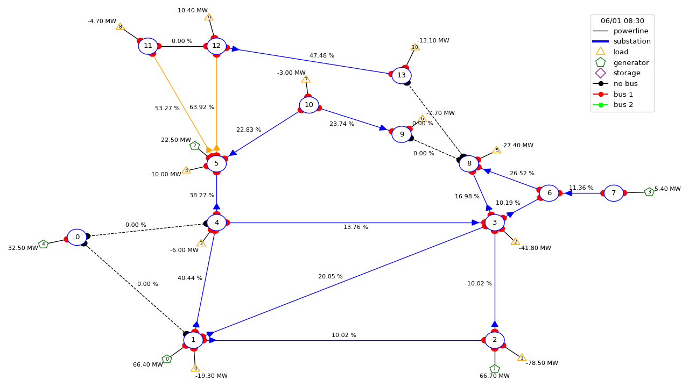

===============================================
Grid2Op_Resilience
===============================================

Grid2Op_Resilience is an adaptation of the Grid2Op_ framework to accomodate resilience powergrid simulation and reinforcement 
learning. This documentation only lists the differences of Grid2Op_Resilience compared to its original version. If a function
 or class is not described here, then it is a copy from Grid2Op. Please 
 check the documentation for Grid2Op_. 
.. _Grid2Op: https://grid2op.readthedocs.io/en/latest/index.html

**Added Features**

  - simulates with DC instead of AC powerflows
  - allows more than one generater or load to go offline before terminating
  - action to restore powergrid from a blackout state  
  - automatically divide the grid into separate subparts for simulation (instead of terminating) 
  when connecting powerlines are cut and re-combine powergrids when the lines are restored (work in progress).
  - evaluation metric that measures the resilience of a grid.

Resilience in powergrids
--------------------
add definition for resilience here.

Examples
--------------------
Separating a generater

|disc_1|

Main module content
---------------------

.. toctree::
   :maxdepth: 2
   :caption: Quickstart

   quickstart
   grid2op
   makeenv
   available_envs
   modeled_elements
   gym
   grid_graph

Plotting capabilities
----------------------

.. toctree::
   :maxdepth: 2
   :caption: Plot

   plot

Technical Documentation
----------------------------

.. toctree::
   :maxdepth: 2
   :caption: Technical Documentation

   action
   agent
   backend
   chronics
   converter
   createbackend
   environment
   episode
   rules
   observation
   opponent
   parameters
   reward
   runner
   space
   utils
   voltagecontroler

Main Exceptions
-----------------------
.. toctree::
   :maxdepth: 2
   :caption: Miscellaneous

   exception

.. include:: final.rst
