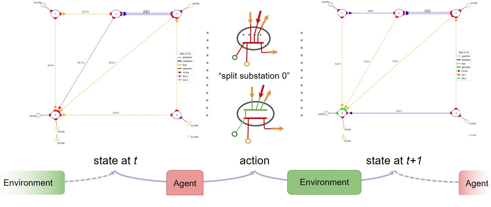

.. Grid2Op documentation master file, created by
   sphinx-quickstart on Wed Jul 24 15:07:20 2019.
   You can adapt this file completely to your liking, but it should at least
   contain the root `toctree` directive.

===============================================
Grid2Op_Resilience
===============================================

Grid2Op_Resilience is an adaptation of the Grid2Op_ framework to accomodate resilience powergrid simulation / reinforcement 
learning. This documentation only lists the differences of Grid2Op_Resilience compared to its original version. If a function
 or class is not described here, then it is a copy from Grid2Op. Please 
 check the documentation for Grid2Op_. 
.._Grid2Op: https://grid2op.readthedocs.io/en/latest/index.html
It is modular and can be use to train reinforcement learning agent or to assess the performance of optimal control
algorithm.

It is flexible and allows the power flow to be computed by the algorithm of your choice. It abstracts the modification
of a powergrid and use this abstraction to compute the **cascading failures** resulting from powerlines disconnection
for example.

**Features**

  - abstract the computation of the "cascading failures"
  - ability to have the same code running with multiple powerflows
  - parallel execution of one agent / controller on multiple independent scenarios (multiprocessing)
  - fully customisable: this software has been built to be fully customizable to serve different
    purposes and not only reinforcement learning, or the L2RPN competition.

Grid2Op philosophy
--------------------
Grid2Op is a python module that aims to make easier the research on sequential decision making applied to power systems.

This package adopt the "reinforcement learning" point of view and is compatible with the openAI gym programming
interface (see section :ref:`openai-gym` for more information).

Applied to power system, the "reinforcement learning" framework ask:

- a "controller" (named Agent) to take an "action" on the powergrid (for example for L2RPN competitions in 2019
  and 2020 these actions consist in modifying the connectivity of the powergrid).
- the "environment" (*a.k.a* the "real world") applies that action on the powergrid, applies some other modifications
  and return the next state.

The goal of grid2op is to model "sequential decision making" that could be made by human operators, for example
changing the configuration of some "substations" as demonstrate in the figure below:

|episode_example|

Any kind of "controller" can be implemented using this framework even though it has been inspired by the
"reinforcement learning" community. You can implement some heuristic "controllers" (some examples are available in the
:ref:`agent-module` module description), "controllers" that comes from the Optimization community
(for example "Optimal Power Flow") or
"Model Predictive Control". One of the goal of Grid2Op is to allow everyone to contribute to closing the gap
between all these research communities.

Main module content
---------------------

.. toctree::
   :maxdepth: 2
   :caption: Quickstart

   quickstart
   grid2op
   makeenv
   available_envs
   modeled_elements
   gym
   grid_graph

Plotting capabilities
----------------------

.. toctree::
   :maxdepth: 2
   :caption: Plot

   plot

Technical Documentation
----------------------------

.. toctree::
   :maxdepth: 2
   :caption: Technical Documentation

   action
   agent
   backend
   chronics
   converter
   createbackend
   environment
   episode
   rules
   observation
   opponent
   parameters
   reward
   runner
   space
   utils
   voltagecontroler

Main Exceptions
-----------------------
.. toctree::
   :maxdepth: 2
   :caption: Miscellaneous

   exception

.. include:: final.rst
